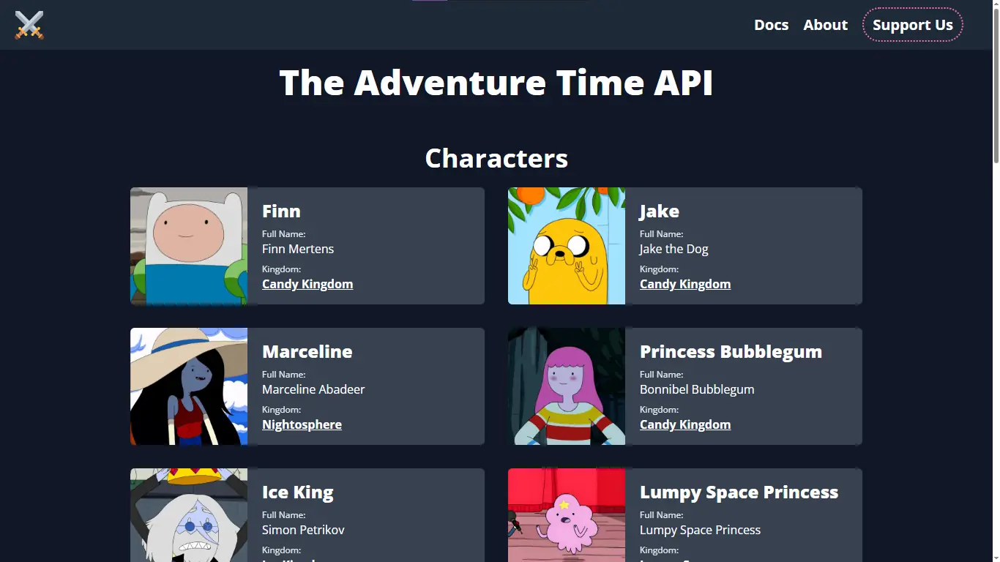

# Adventure Time API

## Getting Started
See some examples on our [Home Page](https://adventure-time-api-docs.vercel.app)

## Documentation
Check the endpoints in our [documentation](https://adventure-time-api-docs.vercel.app/docs)

## Logo
The logo was taken from [twemoji](https://twemoji.twitter.com/content/twemoji-twitter/en.html)

# Any Character, Kingdom or Episode Missing?
The team is small but, you can contribute with data. [Go to the Backend repository](https://github.com/LuisFernandoLG/adventure-time-api)